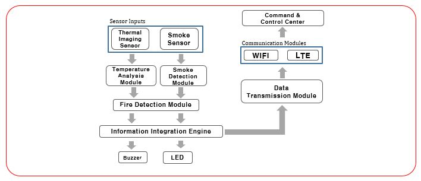
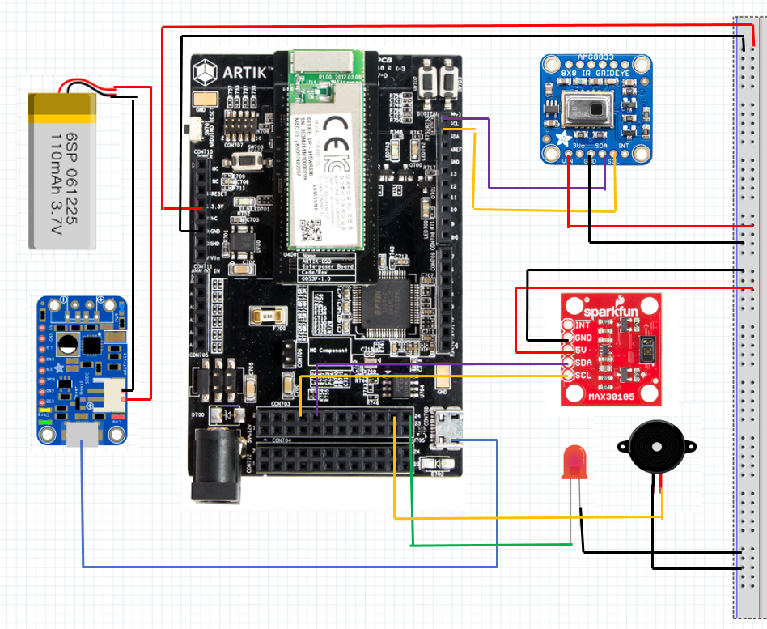
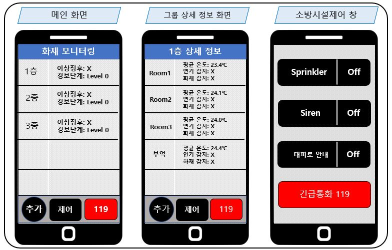
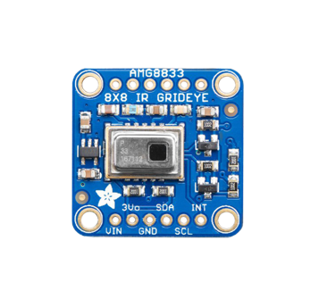
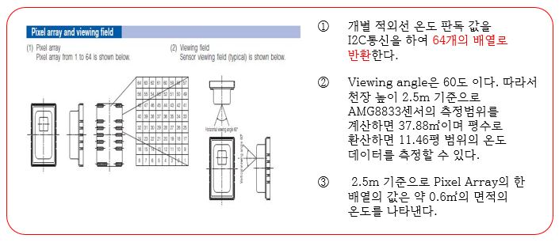
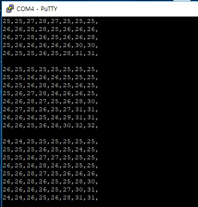
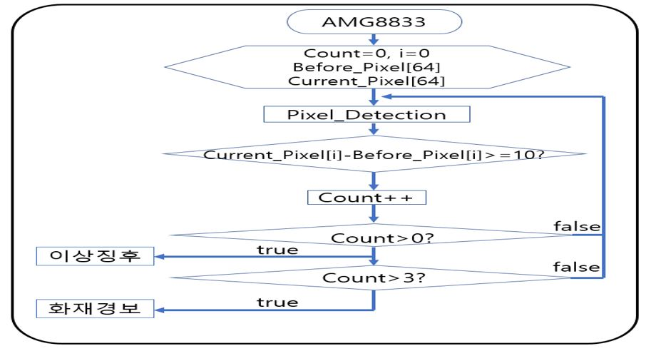

# Design of Fire Detection and Fire Response System based on IoT using Thermal Imaging  Sensor #

Woo-Jong Kim, Hyeon-Sung Kim, Seong-Hun Park, Jae-Yeong Park  Joong-Jin Kook

*Dept of Information Protection Engineering, Sangmyung University

## 시연영상 ##

https://drive.google.com/open?id=1S5DUTUIdCixG_LY5UgHv7O9SXFefIG3v

## Development environment ##

1. Artik053 module
2. Artik IDE
3. ARTIK 053 SDK 1.0
4. Toolchain: arm-none-eabi 4.9-2015q3
5. Languge: C Langage
6. Artik Cloud

## 설계 배경 ##

 2017년 12월 21일에 발생한 **제천 스포츠센터 화재**와 2018년 01월 26일 **밀양 세종병원 화재**는 많은 인명피해를 입혔다. 이로 인해 사회적으로 화재 재난에 대한 관심이 높아졌으며 화재 재난을 막고, 인명피해를 줄일 수 있는 방안이 간구 되고 있다.

## 설계 목적 ##

1. 기존의 화재감지기보다 신속하고 정확한 화재감지기 구현
2. IoT(Internet of Things)기술을 접목하여 화재감시 및 모니터링을 할 수 있는 시스템 설계
3. 시야확보가 힘든 화재현장에서 피해자에게 대피로를 안내하는 시스템을 구현

## 기존 화재감지기의 문제점 ##

1. 감지센서의 한계로 인한 오감지율 및 오작동 높다.
2. 정확한 화재 발생 위치 파악이 불가능하다.
3. 사람이 부재중일 경우 화재 알림이 불가능하다.

## System Architecture ##

 설계된 화재감지기는 열화상 이미지센서, 연기감지광학센서에서 측정된 데이터를 각 분석 모듈을 통해 화재를 감지하며 상황에 따라 Buzzer와 LED를 통하여 화재 경보를 알린다. 또한 분석된 데이터는 WiFi, LTE통신을 통하여 Command & Control Center로 전송하여 실시간으로 화재를 감시 및 모니터링 할 수 있도록 설계하였다. 본 설계작품은 **Artik Cloud**를 통하여 Command & Control Center를 구성하였다. Artik Cloud는 IoT Device 간의 상호 운용성을 가속화하고 새로운 데이터 통찰력을 가능하도록 설계된 개방형 데이터교환 플랫폼이다.

## Hardware Configuration ##

  설계한 화재감지기는 Artik053 보드를 기반으로 AMG8833센서, MAX30501센서, LED, Buzzer, Power Boost 500 Charger, 리튬 배터리로 구성하였다.         
 Artik053은 삼성에서 개발한 IoT(Internet of Things)를 위한 하드웨어 플랫폼이다.[2] AMG8833은 Panasonic에서 개발한 열화상 이미지 센서로 GridEYE라고도 불리며, I2C통신을 통해 64개의 개별 적외선 온도 판독 값을 배열로 반환한다.[3] MAX30105센서는 세 개의 LED(빨강, 초록, IR)와 매우 민감한 photon detector를 가지고 있는데, LED를 번갈아 펄스 신호를 주고 무엇이 반사돼서 돌아오는지를 검출한다.[4] 이를 통해 불에서 나는 연기를 감지할 수 있다. LED는 화재감지기의 작동 유무를 파악하기 위해 사용되었으며, 화재가 발생하면 시각적인 화재경보를 한다. Buzzer는 화재 발생상황에서 청각적인 화재경보를 한다. Power Boost 500 Charger와 리튬 배터리는 화재상황에서 전력이 차단되었을 경우를 대비하여 구성하였다.

## Application Configuration ##

 **메인 화면**은 그룹별로 화재 감시상황을 모니터링 할 수 있도록 구성하였다. 메인화면에서 그룹을 누르면 해당 그룹의 상세 정보 화면으로 넘어 간다. 애플리케이션의 하단에는 [추가]버튼, [제어]버튼, [119]버튼을 만들었다. 메인화면에서의 [추가]버튼은 그룹을 추가하는 버튼이며, **그룹 상세 정보 화면**에서의 [추가]버튼은 해당 그룹에 화재감지기를 추가하는 버튼이다. [제어]버튼을 누르면 소방시설제어 창으로 이동하며 건물의 Sprinkler, Siren, 대피로 안내 시스템을 제어 가능하다. [119]버튼은 사용자가 화재방생 및 긴급 상황 시 119구조대에 즉시 연락을 취할 수 있도록 돕는다. 

## 열화상 이미지센서(Grideye 특징) ##

본 논문의 설계된 화재감지기는 열화상 이미지 센서인 <그림 4>의 AMG8833센서를 이용한다. 
 AMG8833은 Panasonic에서 개발한 열화상 이미지 센서로 GridEYE라고도 불리며, <그림 5>에서 보여주는 거와 같이 64개의 Pixel Array를 가지고 있다. AMG8833센서는 개별 적외선 온도 판독 값을 I2C 통신을 통하여 64개의 배열로 반환해 준다. 
 AMG8833센서의 Viewing angle은 60도 이다. 따라서 천장 높이 2.5m 기준으로 AMG8833센서의 측정범위를 계산하면 37.88㎡이며 평수로 환산시 11.46평 범위의 온도 데이터를 측정할 수 있다. 또한 2.5m 기준으로 Pixel Array의 한 배열의 값은 약 0.6㎡의 면적의 온도를 나타낸다.
 <그림 6>은 AMG8833센서를 이용하여 실제 64개의 Pixel Array의 온도 데이터를 측정한 자료이다.

## 열화상 이미지센서 기반의 화재감지 알고리즘 설계  ##

<그림 6>은 열화상 이미지센서 기반의 화재감지 알고리즘 순서도를 나타낸다. 본 논문은 기존의 차동식 감지기의 감지방식인 분당 온도상승률이 15℃ 이상 일 경우 작동되는 특징과 64개의 Pixel Array로 온도데이터를 얻을 수 있는 열화상 이미지 센서 AMG8833의 특성을 결합하여 화재감지 알고리즘을 설계하였다.
 본 논문에서 설계한 화재감지기는 열화상 이미지 센서인 AMG8833을 통하여 1분마다 64개의 Pixel Array에 해당하는 온도데이터를 읽어온다. 읽어온 온도데이터는 Current_Pixel 배열에 저장되며 이전 Current_Pixel 배열 데이터는 Before_Pixel 배열에 저장한다. 
 반복문을 통하여 Current_Pixel[i]-Before_Pixel[i]>=10 경우를 Count하며 Count된 값은 이상징후의 수를 의미한다.
Current_Pixel[i]-Before_Pixel[i]>=10 경우는 천장높이 2.5m를 기준으로 화재감지기는 약 0.6㎡의 면적의 분당 온도상승률이  15℃ 이상임을 뜻한다. 
 Count된 이상징후의 수가 0보다 크다면 사용자에게 이상징후가 발생함을 알리다. Count된 이상이징후의 수가 4 이상이라면 2.5m를 기준으로 약 3.2㎡의 면적에서 분당 온도상승률이 15℃ 이상 일 경우이며 이는 일반적인 실내에서 발생할 수 없는 상황이다. 이 경우 화재 발생이 매우 의심되는 상황이며 화재경보를 통해 화재 사실을 알린다.  

